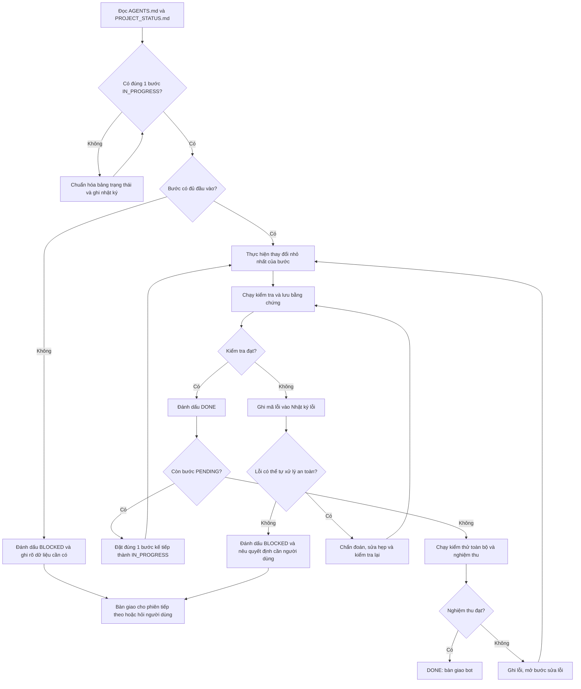
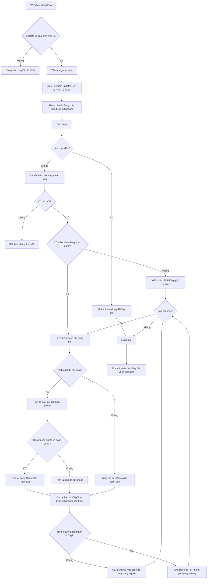

# Telegram News Bot — trạng thái và bàn giao

> Đây là nguồn trạng thái duy nhất của dự án. Mọi phiên/chat phải cập nhật file này trước khi chuyển bước.

## Tóm tắt hiện tại

- Cập nhật gần nhất: `2026-09-23`
- Trạng thái dự án: `DONE` — vận hành từ repo public `thepbm95/telegram-news-bot-public`, state ở repo private `thepbm95/telegram-news-bot`
- Bước đang thực hiện: `Không có — P25–P35 đã hoàn tất`
- Bước tiếp theo: `Theo dõi Actions ở repo public; khi model chính hết quota xem summaries_by_provider để xác nhận model dự phòng`
- Lỗi đang mở: `0`
- Blocker: không có.
- Đặc tả gốc: `docs/superpowers/specs/2026-09-18-telegram-news-bot-design.md`
- Đặc tả P17: `docs/superpowers/specs/2026-09-19-telegram-multi-subscriber-design.md`
- Đặc tả P25: `docs/superpowers/specs/2026-09-23-telegram-category-selection-design.md`
- Plan P26–P32: `docs/superpowers/plans/2026-09-23-telegram-category-selection.md`

## Decision tree điều phối triển khai



## Decision tree khi bot chạy



## Bảng tiến độ

| ID | Bước | Trạng thái | Tiêu chí hoàn thành | Bằng chứng/kết quả |
|---|---|---|---|---|
| P00 | Chốt yêu cầu sản phẩm | DONE | Nguồn, người nhận, độ dài và chi phí được xác định | 7 RSS; chat riêng; tối đa 300 từ; 0 đồng |
| P01 | Xác nhận quota/model | DONE | Model đáp ứng khoảng 300 bài/ngày | Gemini 3.1 Flash Lite: 15 RPM, 250K TPM, 500 RPD |
| P02 | Viết đặc tả kiến trúc | DONE | Đặc tả không có TBD/TODO và đã commit | Commit `e956d21` |
| P03 | Người dùng duyệt đặc tả | DONE | Người dùng xác nhận thiết kế và quy tắc tóm tắt | Đã duyệt; đổi giới hạn lưu state từ 5.000 xuống 2.000 bài |
| P04 | Viết kế hoạch triển khai | DONE | Có kế hoạch theo file, test và commit nhỏ | Plan có 10 task/50 step; self-review không có placeholder |
| P05 | Tạo khung Python và cấu hình | DONE | Package cài/import được; config/secrets được kiểm tra; test nền đạt | `python -m pytest -q`: 3 passed; `compileall` và import đạt |
| P06 | RSS và chuẩn hóa bài | DONE | Parse đủ 7 feed; gộp URL trùng; fixture test đạt | 8 test pass; live check: 7 feed, 538 candidate từ cả hai nguồn |
| P07 | Trích nội dung hai báo | DONE | Fixture VnExpress/Dân trí tách đúng nội dung chính | 11 test pass; live: VnExpress 468 từ, Dân trí 663 từ |
| P08 | State và chống gửi trùng | DONE | State atomic, giới hạn 2.000 bài/30 ngày; pipeline sẽ kiểm tra thời điểm mark seen | 16 test pass; corrupt state không bị âm thầm ghi đè |
| P09 | Gemini và tóm tắt dự phòng | DONE | Đúng model/quota; độ dài đúng; fallback hoạt động | 21 test pass; retry 429, 10 RPM, 450 RPD/Pacific và trần 300 từ được kiểm tra |
| P10 | Gửi Telegram | DONE | Chia tin an toàn; xử lý lỗi; gửi thật chờ secrets ở checkpoint cuối | 27 test pass; HTTP payload/chunk/403/getUpdates đều kiểm tra bằng MockTransport |
| P11 | Ghép pipeline và CLI dry-run | DONE | Luồng end-to-end mock đạt; dry-run không gửi/không đổi state | 36 test pass; live dry-run đọc 538 ứng viên, trích 1 bài và `STATE_UNCHANGED=True` |
| P12 | GitHub Actions và lưu state | DONE | Workflow có lịch/chạy tay, concurrency và quyền push đúng | Structural test và toàn bộ 37 test đạt; workflow chỉ commit khi `state/seen.json` đổi |
| P13 | Kiểm thử toàn bộ | DONE | Unit/integration test đạt; không lộ secret | 39 test và compileall đạt; secret scan sạch; live dry-run 538 ứng viên, state không đổi |
| P14 | Bàn giao và hướng dẫn vận hành | DONE | README đủ; người dùng có thể cấu hình workflow đầu tiên | README có quy trình Gemini/BotFather/GitHub, dry-run, gửi thử 1 bài, xử lý lỗi và tắt khẩn cấp |
| P15 | Setup tự động, xoay credential và chạy workflow đầu tiên | DONE | Một lệnh chạy được từ mọi thư mục, tự tìm bot/chat ID và gắn 3 GitHub Secrets; credential cũ bị thu hồi; dry-run và live `limit=1` đạt | Secrets mới đã cấu hình; dry-run/live/7 nguồn/bootstrap đạt; race được tái hiện và xác nhận sửa bằng hai run xếp hàng `35418365880`, `35418367635`, đều xanh |
| P16 | Giữ bản tóm tắt trọn câu và đủ nhóm ý chính | DONE | Tóm tắt không vượt trần, không kết thúc giữa câu; prompt yêu cầu bao quát diễn biến, số liệu, hệ quả, phản ứng và kết luận quan trọng | Regression test giữ 160 từ/2 câu hoàn chỉnh thay vì cắt ở từ 174; 50 test đạt; live run `35418932165` gửi 1 bài bằng Gemini, lỗi 0 |
| P17 | Thiết kế Telegram nhiều người đăng ký | DONE | Đặc tả được self-review và người dùng duyệt | Người dùng duyệt ngày 2026-09-19; schema v2, `/start`, `/stop`, cache retry và nghiệm thu thật đã chốt |
| P18 | Lập kế hoạch triển khai nhiều người đăng ký | DONE | Plan có file map, interface, TDD, checkpoint commit và không có placeholder | Người dùng duyệt Native; plan P19–P24/44 bước, self-review đủ coverage/type/5 review-focus; baseline 50 test pass |
| P19 | State schema v2 và migration | DONE | State v1 nâng cấp an toàn; subscriber, offset, giao nhận và cache được lưu/prune đúng | RED đúng 3 lỗi thiếu field; GREEN 20 test state/summarizer và full suite 58 test pass |
| P20 | Telegram command và phân loại lỗi | DONE | Đọc update có offset; gửi theo chat ID; phân biệt 401/403/lỗi tạm thời | RED import thiếu exception; GREEN 16 test Telegram/setup/security-log và full suite 63 test pass |
| P21 | Đồng bộ `/start` và `/stop` | DONE | Lệnh idempotent; chỉ chat riêng; không backlog; phản hồi và offset đúng | RED thiếu module; GREEN 33 test subscription/state/Telegram và full suite 71 test pass |
| P22 | Pipeline giao tin nhiều người | DONE | Tóm tắt một lần; giao/retry theo từng người; không subscriber không gọi Gemini | RED 14 lỗi constructor; GREEN 22 test pipeline/subscription, full suite 78 test pass, live state không đổi |
| P23 | Ghép CLI và tài liệu vận hành | DONE | Main wiring đúng; dry-run không đổi state; README hướng dẫn tài khoản mới | RED 2 lỗi thiếu dependency; GREEN 13 test main/setup/config, CLI help và full suite 80 test pass |
| P24 | Kiểm thử, deploy và nghiệm thu thật | DONE | Test/compile/secret scan/workflow xanh; hai tài khoản nhận đúng và `/stop` hoạt động | Người dùng xác nhận hoạt động; state ẩn danh có 587 entry từng gắn 2 recipient, hiện còn 1 subscriber sau `/stop`, 593 seen và 0 pending; run `35430017459`/`35430561154` xanh; gate cuối 80 test, compileall, secret scan và dry-run đều đạt |
| P25 | Đặc tả và kế hoạch chọn chuyên mục | DONE | Đặc tả và plan được self-review, người dùng duyệt thiết kế | Người dùng duyệt thiết kế và yêu cầu triển khai ngày 2026-09-23; spec `586e564`; plan P26–P32; baseline 80 test pass |
| P26 | Danh mục 55 chuyên mục và RSS | DONE | `feeds.toml` có `id`; đọc ngày `+07`; gộp `feed_ids`; trả tập feed thành công | RED lỗi import `ModelSpec`/`fetch_feeds`; GREEN 92 test; live 55/55 feed, 3.882 ứng viên, 0 thiếu ngày, 58 bài thuộc nhiều chuyên mục |
| P27 | Trích nội dung CafeBiz, GenK, Kenh14 | DONE | Fixture theo cấu trúc thật của 3 báo tách đúng nội dung chính | RED 3 test fixture; GREEN 95 test; live 9/9 bài (3/báo) trích 532–2.567 từ. Fixture tự viết theo cấu trúc HTML thật, không chép nội dung bài |
| P28 | State schema v3 và migration | DONE | v2→v3 đúng; `menu_pending`; prune theo `last_seen_at` | 18 test state; bản sao state thật v2 migrate: 4 subscriber `menu_pending`, 1.204 seen, 0 pending, quota 158 chuyển sang model chính; round-trip v3 đạt |
| P29 | Danh sách chọn và lệnh Telegram | DONE | `/start`, `/chon`, `/danhsach`, `/stop`, lựa chọn số, thông báo một lần | 20 test catalog, 11 test subscription, test Telegram đọc `/chon@bot`, `/danhsach`, số/dải số |
| P30 | Pipeline theo chuyên mục | DONE | Chỉ tải feed hoạt động; khởi tạo theo feed; lọc người nhận; tóm tắt một lần | 20 test pipeline; phát hiện và sửa `E-P30-01` (prune bài của feed chưa làm mới) |
| P31 | Chuỗi model Gemini miễn phí | DONE | Quota/RPM riêng từng model; fallback đúng thứ tự rồi mới local | 12 test summarizer: bỏ qua model hết quota, retry 2 lần rồi chuyển model, lỗi khác chuyển ngay, hết model thì local; full suite 135 test |
| P32 | Ghép CLI, tài liệu, deploy và nghiệm thu | DONE | Full suite/compile/secret scan/workflow xanh; thông báo đến đủ người; chọn số nhận đúng chuyên mục | Local: 135 test, compileall, secret scan sạch; `news-bot --dry-run --limit 3` đọc 55/55 feed, 3.882 ứng viên, state không đổi; diễn tập trên bản sao state thật: 4 thông báo đúng một lần, chọn `1 18 47` khởi tạo 3 feed không gửi, lượt sau gửi đúng 1 bài mới cho đúng người. Deploy: run `35811726082` xanh (135 test trên runner), state thật lên schema 3, 4/4 subscriber đã nhận thông báo (`menu_pending`=0), 1.205 seen, 0 pending, không gửi bài. Run `35811988910`: 1 người chọn 5 chuyên mục, xác nhận gửi thành công, 183 bài khởi tạo không gửi. Run `35812355097`: bài mới đầu tiên gửi đúng người đã chọn (chỉ tải 5 feed của người đó), tóm tắt bằng `gemini-3.1-flash-lite`, 0 lỗi |
| P33 | Menu lệnh Telegram, `/them` và `/bo` | DONE | Gõ `/` hiện danh sách lệnh (`setMyCommands`); `/them` giữ chuyên mục cũ và tối đa 10; `/bo` bớt chuyên mục; test đạt, deploy xanh | RED 12 test; GREEN 147 test, compileall, secret scan sạch. `/them`, `/bo` không kèm số hiện danh sách có tên báo/chuyên mục và dấu ✅; trường `mode` một lần, schema 3 tương thích ngược. Deploy run `35812355097` xanh, `setMyCommands` không lỗi |
| P34 | Giảm phút GitHub Actions | DONE | Lịch 30 phút; lượt lịch không chạy test; ước tính < 2.000 phút/tháng | Người dùng đồng ý sau khi thấy gross ~$3.2, billed $0 (18–23/9). RED 2 test workflow; GREEN 148 test; run `35814262473` xanh 35 giây. Ước tính 48 lượt/ngày ≈ 1.450 phút/tháng. Khuyên người dùng đặt ngân sách Actions $0 |
| P35 | Tách repo public cho code, giữ state ở repo private | DONE | Repo public mới không có lịch sử state/log cũ; workflow đọc/ghi state repo private qua deploy key; secret mới đủ; dry-run và lượt thật xanh; workflow repo cũ tắt; lịch 15 phút; keepalive 60 ngày | Repo public `thepbm95/telegram-news-bot-public` tạo từ một commit không lịch sử (49 file, không state, secret scan sạch, 150 test). Deploy key ghi vào repo state, secret `STATE_DEPLOY_KEY`, biến `STATE_REPOSITORY`/`STATE_BRANCH` đã đặt; workflow bot ở repo public đang tắt để tránh chạy song song. Người dùng nhập 2 secret. Dry-run `35815726828` xanh (55/55 feed). Tắt workflow repo private, bật repo public; lượt thật `35815816044` xanh, push state vào repo private `7bde06b..e671910`. Keepalive tạo commit `6653deb` thành công |

## Nhật ký lỗi

| Mã | Bước | Thời điểm | Biểu hiện | Nguyên nhân | Cách xử lý | Trạng thái |
|---|---|---|---|---|---|---|
| E-P03-01 | P03 | 2026-09-18 | Giao diện báo `No diff available` khi mở để review | Các thay đổi đã được commit nên không còn working-tree diff để hiển thị | Cung cấp link file và bản tóm tắt đặc tả ngay trong chat | RESOLVED |
| E-P04-01 | P04 | 2026-09-18 | Lần tạo implementation plan đầu tiên bị `invalid hunk` | Một dòng trong code block cuối thiếu tiền tố patch | Chia patch thành các phần nhỏ, tạo lại và self-review thành công | RESOLVED |
| E-P05-01 | P05 | 2026-09-18 | Không chạy được RED test: `No module named pytest` | Worktree mới chưa cài development dependencies | Cài test runner, chạy lại RED rồi cài đầy đủ nhóm `dev` | RESOLVED |
| E-P05-02 | P05 | 2026-09-18 | `pip` báo worktree không có `pyproject.toml` | Patch tương đối được ghi nhầm vào checkout chính | Dùng đường dẫn patch có tiền tố worktree; checkout chính đã sạch | RESOLVED |
| E-P05-03 | P05 | 2026-09-18 | Editable install thất bại: `src does not exist` | Packaging metadata trỏ tới `src` trước khi package scaffold được tạo | Cài test runner riêng, hoàn thành RED, tạo package rồi editable install thành công | RESOLVED |
| E-P06-01 | P06 | 2026-09-18 | RSS summary có khoảng trắng sai trước dấu chấm | `BeautifulSoup.get_text(" ")` chèn separator quanh thẻ inline | Chuẩn hóa khoảng trắng trước dấu câu; 8 test pass | RESOLVED |
| E-P07-01 | P07 | 2026-09-18 | Live extractor check dừng với `StopIteration` khi chọn bài theo nguồn | Chuỗi tiếng Việt trong script PowerShell stdin bị lệch encoding nên không khớp source Unicode | Chọn bài theo domain ASCII; live extraction cả hai nguồn thành công | RESOLVED |
| E-P11-01 | P11 | 2026-09-18 | `news-bot --help` lỗi `UnicodeEncodeError` trên Windows | Console launcher dùng CP1252 nên không ghi được phần trợ giúp tiếng Việt | Cấu hình stdout/stderr UTF-8 tại CLI; unit test và lệnh `news-bot --help` đều đạt | RESOLVED |
| E-P12-01 | P12 | 2026-09-18 | Không chạy được YAML parser bổ sung tại máy local | `actionlint`, PyYAML và Ruby không được cài trong môi trường | Giữ kiểm tra cấu trúc workflow bằng pytest; 37 test đạt, không thêm dependency runtime chỉ để lint | RESOLVED |
| E-P14-01 | P14 | 2026-09-18 | `gh repo create --source .` không nhận thư mục hiện tại là Git repository | GitHub CLI không nhận linked worktree có `.git` dạng file khi dùng `--source` | Tạo repo trống rồi thêm `origin` bằng Git; repo private đã được tạo | RESOLVED |
| E-P14-02 | P14 | 2026-09-18 | GitHub từ chối push file workflow | OAuth token của tài khoản `thepbm95` thiếu scope `workflow`; SSH và tài khoản phụ không có quyền thay thế | Người dùng cấp scope `workflow`; push nhánh đầy đủ lên repo private thành công | RESOLVED |
| E-P15-01 | P15 | 2026-09-19 | Telegram bot token và Gemini API key được gửi trực tiếp trong chat | Credential bí mật bị đặt vào kênh hội thoại thay vì GitHub Secrets | Credential cũ đã được thay thế; helper xác minh credential mới và gắn an toàn 3 GitHub Secrets qua stdin | RESOLVED |
| E-P15-02 | P15 | 2026-09-19 | `news-bot --show-chat-id` in Telegram bot token trong log HTTP | Root logger ở mức INFO làm logger `httpx` ghi toàn bộ Bot API URL có token | Đặt logger `httpx/httpcore` ở WARNING; regression test dùng token giả và toàn bộ 40 test đạt | RESOLVED |
| E-P15-03 | P15 | 2026-09-19 | `--setup-github` không xác định được repo khi chạy từ `C:\Users\thep` | `gh repo view` phụ thuộc current working directory thay vì vị trí package đã cài | Fallback đọc `origin` từ repository chứa package; regression test và kiểm tra thật từ home đều đạt | RESOLVED |
| E-P15-04 | P15 | 2026-09-19 | 4 RSS VnExpress thất bại sau 3 lần thử trên GitHub Actions, trong khi Dân trí vẫn tạo 300 ứng viên | CDN VnExpress từ chối User-Agent bot trên IP GitHub bằng HTTP 429/404 | Dùng User-Agent trình duyệt; 47 test đạt và run `35417797275` đọc đủ 538 ứng viên, không còn lỗi feed | RESOLVED |
| E-P15-05 | P15 | 2026-09-19 | Run bootstrap `35417859738` dừng với `Invalid state file structure` trước khi gửi | State tối giản được đặt lại nhưng thiếu object `usage` bắt buộc của schema v1 | Thêm `usage` hợp lệ; load cục bộ đạt và run `35417951021` bootstrap 538 bài, gửi 0 | RESOLVED |
| E-P15-06 | P15 | 2026-09-19 | Run lịch `35418077868` gửi từ state cũ rồi bị từ chối push `fetch first` | Event lịch được tạo trên commit cũ trước khi chờ concurrency lock; checkout mặc định giữ event SHA thay vì đầu nhánh mới nhất | Checkout `github.ref_name`; regression test và hai run cùng event SHA xếp hàng đều xanh, run sau đọc được state do run trước vừa commit | RESOLVED |
| E-P16-01 | P16 | 2026-09-19 | Tóm tắt Telegram kết thúc giữa câu ở “trong khi các” | `_trim_words` cắt cứng phản hồi Gemini tại từ tối đa thay vì giữ ranh giới câu | Hậu xử lý chỉ giữ câu hoàn chỉnh trong giới hạn; prompt yêu cầu đủ nhóm ý chính và mục tiêu giữa khoảng; regression/live workflow đạt | RESOLVED |
| E-P17-01 | P17 | 2026-09-19 | Lệnh rà mã báo không tìm thấy ba file dưới `src/telegram_news_bot` | Package thực tế tên `src/newsbot`; lệnh kiểm tra dùng nhầm đường dẫn | Ghi nhận lỗi, đọc lại đúng ba file tại `src/newsbot` và tiếp tục self-review | RESOLVED |
| E-P17-02 | P17 | 2026-09-19 | Placeholder scan báo hai kết quả tại cú pháp lệnh Telegram | Regex coi `<payload>` và `<tên_bot>` là placeholder dù đây là tham số hợp lệ trong ví dụ command | Thu hẹp scan vào các marker `TBD/TODO/FIXME/XXX`; không thay đổi hành vi đặc tả | RESOLVED |
| E-P17-03 | P17 | 2026-09-19 | Lệnh xem toàn bộ file mới trả exit code 1 dù đã in diff đúng | `git diff --no-index` dùng mã 1 để báo hai đầu vào khác nhau, đây là hành vi chuẩn chứ không phải kiểm tra thất bại | Xác nhận nội dung diff đã đầy đủ; dùng `git diff --check` riêng làm cổng hợp lệ | RESOLVED |
| E-P17-04 | P17 | 2026-09-19 | Push commit đặc tả bị từ chối `non-fast-forward` | Workflow lịch vừa commit `state/seen.json` lên cùng nhánh trong lúc chuẩn bị push | Giữ commit tài liệu, rebase lên state mới nhất rồi push lại; không ghi đè state vận hành | RESOLVED |
| E-P19-01 | P19 | 2026-09-19 | Không thể chạy tự động `task-start`/`task-done`/`sdd-workspace` của kỹ năng executing-plans | Gói skill thiếu hai script đầu/cuối; script còn lại dùng CRLF và WSL Git không đọc được `.git` chứa đường dẫn Windows | Dùng đúng cấu trúc workspace/ledger nhưng tạo brief và ghi completion thủ công; giữ nguyên RED→GREEN, full-suite gate và commit từng task | RESOLVED |
| E-P24-01 | P24 | 2026-09-19 | Lệnh kiểm tra lịch sử state dừng với `An empty pipe element is not allowed` | Pipeline PowerShell được đặt trực tiếp sau khối `foreach`, tạo cú pháp không hợp lệ | Gom kết quả vào biến rồi mới format; lệnh sửa chạy thành công và không đọc hoặc in chat ID | RESOLVED |
| E-P24-02 | P24 | 2026-09-19 | Lệnh gộp cleanup scratch và commit bị công cụ chặn trước khi thực thi | Một command vừa chứa xóa đệ quy vừa chứa thao tác Git nên không qua chính sách an toàn | Không có file nào bị thay đổi bởi lệnh; tách kiểm tra đường dẫn, cleanup và commit thành các thao tác riêng | RESOLVED |
| E-P30-01 | P30 | 2026-09-23 | Test `last_seen` phát hiện bài vẫn còn trong RSS bị prune rồi gửi lại sau khi bot/RSS ngừng quá 7 ngày | `_save` đầu lượt prune theo `last_seen_at` trước khi tải RSS để làm mới mốc | Prune bảo vệ bài thuộc feed đã khởi tạo nhưng chưa được tải thành công trong lượt; regression test | RESOLVED |

Quy ước mã: `E-<bước>-<số thứ tự>`, ví dụ `E-P07-01`.

## Quyết định đã chốt

| Mã | Quyết định | Lý do |
|---|---|---|
| D001 | Chỉ gửi vào chat Telegram riêng | MVP đơn giản và riêng tư |
| D002 | Theo dõi 4 RSS VnExpress và 3 RSS Dân trí | Phạm vi người dùng chỉ định |
| D003 | Tóm tắt `min(20–25% số từ, 300 từ)` | Giữ đủ nội dung nhưng tránh tin quá dài |
| D004 | Dùng `gemini-3.1-flash-lite` | Quota project đủ cho khoảng 300 bài/ngày |
| D005 | Giới hạn nội bộ 10 RPM và 450 RPD | Chừa dung lượng cho retry và sai số |
| D006 | GitHub Actions chạy mỗi 15 phút | Vận hành 0 đồng, không cần máy cá nhân bật liên tục |
| D007 | Lần đầu chỉ ghi nhận backlog | Tránh gửi hàng loạt bài cũ |
| D008 | Chỉ đánh dấu seen sau khi Telegram gửi thành công | Không làm mất tin khi API lỗi |
| D009 | Chỉ giữ tối đa 2.000 bài hoặc 30 ngày trong state | Đủ chống trùng và giữ file nhỏ |
| D010 | Không cắt cứng bản tóm tắt giữa câu | Giữ nội dung dễ đọc; nếu Gemini vượt trần thì bỏ trọn chi tiết phụ cuối thay vì chặt câu |
| D011 | Dùng `/start` và `/stop` với trạng thái giao theo từng chat ID | Cho nhiều tài khoản riêng nhận cùng bản tin mà không cần database và không gửi trùng khi một người lỗi |
| D012 | Schema v2 ghi entry/cache trước khi gửi và chỉ thêm từng chat vào `delivered_to` sau thành công | Cho phép retry bài đã rời RSS mà không gọi Gemini lại; thay thế quy tắc D008 ở luồng nhiều subscriber |
| D013 | Người dùng chọn tối đa 10 chuyên mục trong danh mục 55 mục của 5 báo bằng cách trả lời số | Không cần webhook; bot 15 phút mới chạy nên một lần trả lời là trải nghiệm tốt nhất |
| D014 | Khi nâng cấp, mọi subscriber chuyển sang chưa chọn và nhận đúng một thông báo kèm danh sách; không gửi bù | Người dùng yêu cầu chọn lại thay vì tiếp tục nhận 7 chuyên mục cũ |
| D015 | Chỉ tải RSS của chuyên mục có người chọn; khởi tạo theo từng chuyên mục | Giảm tải báo và state; không gửi dồn bài cũ khi chuyên mục mới được chọn |
| D016 | Prune theo `last_seen_at` 7 ngày, không xóa bài còn trong RSS; trần an toàn 10.000 | Thay D009: với nhiều chuyên mục, trần 2.000 có thể xóa bài còn trong RSS và gây gửi trùng |
| D017 | Chuỗi model miễn phí `gemini-3.1-flash-lite` → `gemini-3.5-flash-lite` → `gemma-4-31b-it` → local | Quota riêng từng model, 0 đồng khi không bật billing; không dùng nhiều key/project để lách quota |
| D018 | Bỏ Kenh14 Xã hội, Kenh14 Sức khỏe, CafeBiz Câu chuyện kinh doanh và các chuyên mục bỏ hoang | Quá nhiều bài hoặc không còn cập nhật |
| D019 | Lịch 30 phút (`7,37`), lượt lịch không chạy test | Repo private: 15 phút tốn ~2.900 phút/tháng > 2.000 miễn phí; 30 phút ~1.450 phút. Thay D006 |
| D020 | Code ở repo public mới (lịch sử sạch); state ở repo private hiện tại qua deploy key; không mã hóa state | Public chạy Actions không giới hạn phút; mã hóa làm repo phình vài GB/năm; repo cũ có 240 commit state và 445 log nên không chuyển public trực tiếp |

## Quy trình cập nhật sau mỗi bước

1. Đặt bước hiện tại thành `IN_PROGRESS` trước khi sửa.
2. Nếu lỗi, tạo mã lỗi và ghi ngay vào bảng lỗi.
3. Chạy kiểm tra gắn với tiêu chí hoàn thành.
4. Ghi lệnh kiểm tra và kết quả ngắn gọn vào cột bằng chứng.
5. Chuyển bước thành `DONE` chỉ khi kiểm tra đạt.
6. Đặt đúng một bước kế tiếp thành `IN_PROGRESS`.
7. Cập nhật phần `Tóm tắt hiện tại` và commit.

## Mẫu bàn giao sang chat/tài khoản khác

Sao chép đoạn này vào chat mới:

```text
Hãy đọc AGENTS.md, PROJECT_STATUS.md và đặc tả được liên kết trong đó.
Tiếp tục đúng bước đang IN_PROGRESS; không làm lại bước DONE.
Trước khi kết thúc, cập nhật PROJECT_STATUS.md, nhật ký lỗi, bằng chứng kiểm tra và bước tiếp theo.
Không ghi secrets vào repository hoặc chat.
```

## Nhật ký cập nhật

- `2026-09-18`: Tạo decision tree, bảng tiến độ, nhật ký lỗi và quy trình bàn giao liên tài khoản.
- `2026-09-18`: Ghi nhận `E-P03-01`; chuyển review đặc tả sang bản tóm tắt nội tuyến.
- `2026-09-18`: Người dùng duyệt đặc tả, giảm giới hạn state xuống 2.000 bài và chuyển sang P04.
- `2026-09-18`: Hoàn thành P04 với plan 10 task/50 step; chuyển P05 sang `IN_PROGRESS`.
- `2026-09-18`: Hoàn thành P05; 3 test pass, package import đạt; chuyển P06 sang `IN_PROGRESS`.
- `2026-09-18`: Hoàn thành P06; parse trực tiếp đủ 7 RSS với 538 candidate; chuyển P07 sang `IN_PROGRESS`.
- `2026-09-18`: Hoàn thành P07; live extraction đạt trên cả VnExpress và Dân trí; chuyển P08 sang `IN_PROGRESS`.
- `2026-09-18`: Hoàn thành P08; atomic state và prune 2.000 bài/30 ngày đạt; chuyển P09 sang `IN_PROGRESS`.
- `2026-09-18`: Hoàn thành P09; Gemini adapter, quota/rate limit và fallback đạt; chuyển P10 sang `IN_PROGRESS`.
- `2026-09-18`: Hoàn thành P10; Telegram adapter đạt qua HTTP mock, không dùng token thật; chuyển P11 sang `IN_PROGRESS`.
- `2026-09-18`: Hoàn thành P11; 36 test đạt, live dry-run kiểm tra 538 ứng viên và không đổi state; chuyển P12 sang `IN_PROGRESS`.
- `2026-09-18`: Hoàn thành P12; workflow 15 phút, chạy tay, concurrency và commit state đã qua structural test; chuyển P13 sang `IN_PROGRESS`.
- `2026-09-18`: Hoàn thành P13; 39 test, compileall, secret scan và live dry-run đều đạt; chuyển P14 sang `IN_PROGRESS`.
- `2026-09-18`: Hoàn thành P14 và acceptance gate: compileall đạt, 39 test đạt, live dry-run đọc 538 ứng viên/trích 1 bài, state không đổi; dự án `READY_FOR_USER_SECRETS`.
- `2026-09-18`: Tạo repo private `thepbm95/telegram-news-bot` và push nhánh `feat/telegram-news-bot`; chờ người dùng thêm secrets để thử workflow.
- `2026-09-19`: Mở P15 và E-P15-01 vì credential được gửi trong chat; dừng sử dụng, chờ người dùng xoay khóa và nhập trực tiếp vào GitHub Secrets.
- `2026-09-19`: Mở E-P15-02 sau khi CLI để lộ token qua INFO log của `httpx`; dừng hướng dẫn chạy lại cho tới khi có bản sửa đã kiểm thử.
- `2026-09-19`: Đóng E-P15-02; regression test chứng minh token giả không còn xuất hiện trong log, toàn bộ 40 test đạt.
- `2026-09-19`: Người dùng duyệt helper setup một bước; chuyển P15 sang `IN_PROGRESS` để tự động gắn GitHub Secrets an toàn.
- `2026-09-19`: Hoàn thành helper `--setup-github`; tự xác minh bot, lấy chat ID và gắn 3 secrets qua stdin; chuyển P15 về `BLOCKED` tại checkpoint credential người dùng.
- `2026-09-19`: Mở E-P15-03; tái hiện `gh repo view` thất bại ngoài repository, xác nhận repo discovery phụ thuộc sai vào working directory.
- `2026-09-19`: Đóng E-P15-03; helper tự tìm origin từ package, 45 test đạt và kiểm tra thật từ `C:\Users\thep` trả đúng repo.
- `2026-09-19`: Cấu hình thành công 3 GitHub Secrets mới; dry-run và live `limit=1` đều xanh, Telegram nhận 1 bài thử.
- `2026-09-19`: Mở rồi đóng E-P15-04; xác định CDN VnExpress chặn User-Agent bot trên runner, đổi sang nhận diện trình duyệt và khôi phục đủ 538 ứng viên từ 7 nguồn.
- `2026-09-19`: Mở rồi đóng E-P15-05; sửa state bootstrap thiếu `usage`, ghi nhận 538 bài cũ mà không gửi và xác nhận vòng sau chỉ gửi 9 mục RSS mới.
- `2026-09-19`: Mở rồi đóng E-P15-06; sửa checkout SHA cũ sau concurrency wait và chứng minh bằng hai run xếp hàng cùng SHA, run sau dùng đúng state mới.
- `2026-09-19`: Hoàn thành P15; dự án `DONE`, 48 test đạt, đủ 7 nguồn và lịch GitHub Actions mỗi 15 phút đang hoạt động.
- `2026-09-19`: Mở rồi đóng E-P16-01; tái hiện bài 698 từ bị cắt đúng trần 174 từ, thay cắt cứng bằng giữ ranh giới câu và bổ sung yêu cầu đủ nhóm ý chính.
- `2026-09-19`: Hoàn thành P16; 50 test đạt và live run `35418932165` gửi thành công 1 bản tóm tắt Gemini theo logic mới.
- `2026-09-19`: Người dùng xác nhận chất lượng tóm tắt đạt; mở P17 và viết đặc tả nhiều người đăng ký để review trước implementation plan.
- `2026-09-19`: Self-review đặc tả P17 đạt; bổ sung `pending_message` để retry không gọi Gemini lại, cập nhật decision tree và giữ P17 `IN_PROGRESS` tại checkpoint người dùng duyệt.
- `2026-09-19`: Người dùng duyệt P17; chuyển P17 sang `DONE`, mở P18 và thêm các checkpoint P19–P24 cho triển khai, kiểm thử và nghiệm thu nhiều người đăng ký.
- `2026-09-19`: Hoàn thành bản plan P19–P24 với 44 bước TDD/commit; self-review đủ đặc tả, 5 review-focus case và interface xuyên task; giữ P18 tại checkpoint người dùng chọn cách thực thi.
- `2026-09-19`: Người dùng duyệt plan và chọn Native; chuyển P18 `DONE`, mở P19. Ghi E-P19-01 và ruling dùng ledger thủ công vì script executor không tương thích môi trường Windows/WSL.
- `2026-09-19`: Hoàn thành P19 bằng TDD; state v1/v2, validation và prune metadata đạt, full suite 58 test pass; chuyển P20 `IN_PROGRESS`.
- `2026-09-19`: Hoàn thành P20 bằng TDD; targeted send, command parser/offset và taxonomy 401/403 đạt, full suite 63 test pass; chuyển P21 `IN_PROGRESS`.
- `2026-09-19`: Hoàn thành P21 bằng TDD; seed một lần, command idempotent/thứ tự, offset và cleanup pending đạt, full suite 71 test pass; chuyển P22 `IN_PROGRESS`.
- `2026-09-19`: Hoàn thành P22 bằng TDD; fan-out/cache retry/recipient isolation/no-subscriber đạt, full suite 78 test pass và state vận hành không đổi; chuyển P23 `IN_PROGRESS`.
- `2026-09-19`: Hoàn thành P23 bằng TDD; main/dry-run wiring và README nhiều tài khoản đạt, full suite 80 test pass; chuyển P24 `IN_PROGRESS`.
- `2026-09-19`: P24 local verification đạt: compileall, 80 test, secret scan sạch, live dry-run đọc 538 ứng viên/trích 1 bài và SHA256 state không đổi.
- `2026-09-19`: Push code sau rebase state và chạy migration thật `35429571515` thành công; schema 2, 588 seen, 1 subscriber, offset đã lưu, 0 pending, gửi 1/lỗi 0. P24 tạm `BLOCKED` chờ tài khoản thứ hai gửi `/start`.
- `2026-09-19`: Người dùng xác nhận luồng nhiều tài khoản hoạt động tốt. Lịch sử state ẩn danh cho thấy 587 entry đã được backfill cho 2 recipient và hiện còn 1 subscriber sau `/stop`; không có pending message.
- `2026-09-19`: Hoàn tất P24/P17; self-review toàn nhánh không có lỗi Critical/Important, ghi nhận một hạn chế Minor về retry tin bị chia nhiều phần. Gate cuối đạt: compileall, 80 test, secret scan sạch, dry-run 538 ứng viên/1 bài và state không đổi.
- `2026-09-19`: E-P24-02 được đóng; lệnh cleanup/commit gộp bị chặn trước khi chạy, sau đó được tách thành các thao tác an toàn độc lập.
- `2026-09-23`: Người dùng duyệt thiết kế chọn báo/chuyên mục (D013–D018); mở P25–P32 và chuyển P25 sang `IN_PROGRESS`.
- `2026-09-23`: Hoàn thành P25 (spec + plan); chuyển P26 sang `IN_PROGRESS`, thực thi inline.
- `2026-09-23`: Hoàn thành P26; 92 test, live 55/55 RSS; chuyển P27 sang `IN_PROGRESS`.
- `2026-09-23`: Hoàn thành P27; 95 test, live 9/9 bài VCCorp; chuyển P28 sang `IN_PROGRESS`.
- `2026-09-23`: Hoàn thành P28–P31 trong một commit vì state v3, lệnh Telegram và pipeline phụ thuộc nhau; 135 test; chuyển P32 sang `IN_PROGRESS`.
- `2026-09-23`: P32 local gate đạt (README, workflow `GEMINI_MODELS`, dry-run, diễn tập end-to-end); chuẩn bị push và nghiệm thu thật.
- `2026-09-23`: Deploy P26–P32; run `35811726082` xanh, 4 thông báo đã gửi. P32 chờ nghiệm thu thật của người dùng.
- `2026-09-23`: Người dùng yêu cầu menu lệnh khi gõ `/` và lệnh `/them`, `/bo`; P32 chuyển `BLOCKED` chờ lượt gửi thật; mở P33 `IN_PROGRESS`.
- `2026-09-23`: P33 local đạt 147 test; chuẩn bị deploy.
- `2026-09-23`: P32 và P33 DONE: bài mới đầu tiên gửi đúng người theo chuyên mục; menu lệnh `/` đã đăng; 147 test.
- `2026-09-23`: Repo private tốn ~96 phút Actions/ngày (> 2.000 phút miễn phí/tháng khi chạy đủ tháng); mở P34 `IN_PROGRESS`.
- `2026-09-23`: P34 DONE; lịch 30 phút, lượt lịch bỏ test; run `35814262473` 35 giây.
- `2026-09-23`: Người dùng đồng ý tách repo public; mở P35 `IN_PROGRESS`.
- `2026-09-23`: Tạo repo public, deploy key và biến state; P35 BLOCKED chờ người dùng nhập 2 secret. Từ nay code nằm ở repo public nhánh `main`; repo private chỉ lưu state.
- `2026-09-23`: P35 DONE; bot chạy từ repo public 15 phút/lần, state lưu repo private, workflow repo cũ đã tắt.
